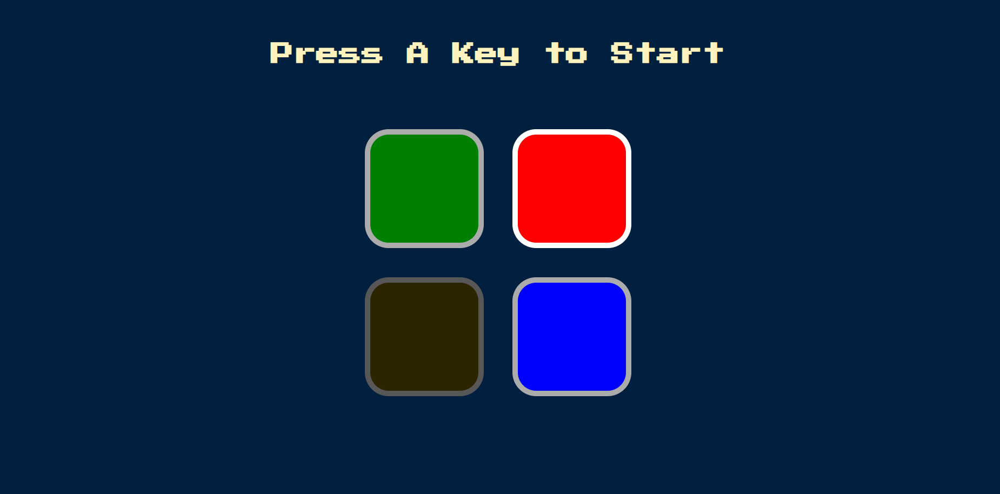
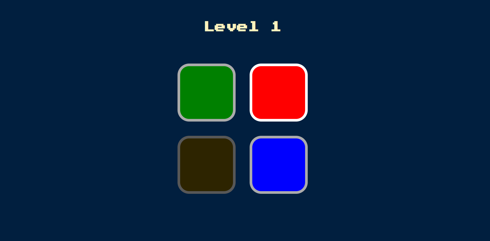
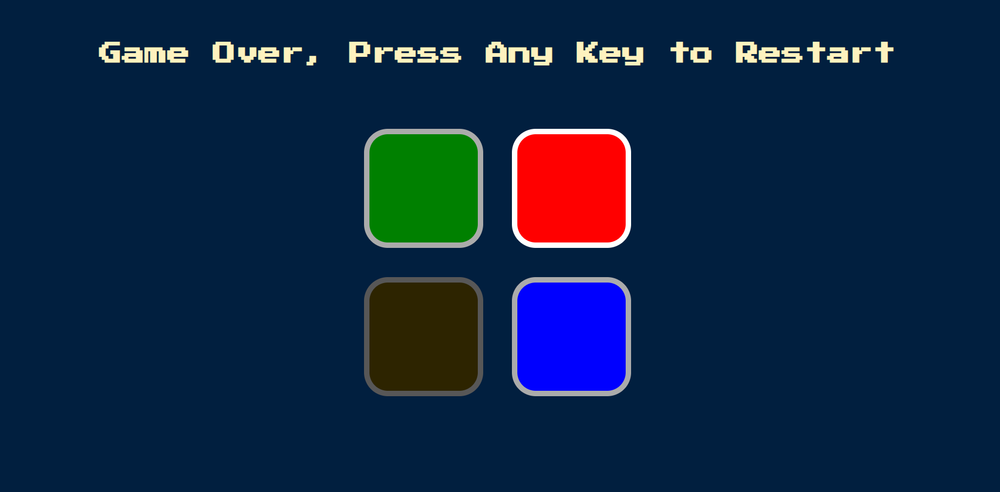

...

#  Simon Game Website / jQuery / App Brewery - Angela Yu Project

...

# A fully responsive Game EXAMPLE project written in HTML-CSS-JS (jQuery) showing a website.

* This project is an example that was built along with a Udemy course (Angela Yu - App Brewery) showing how to create a responsive website in HTML-CSS-JS (jQuery). Every part of this project is sample code.

* In this project, the user moves to the next step by clicking on the first of the 4 different colored buttons that blinks. In the next step, any color blinks again and the user has to press the buttons before clicked in the previous level in order. If the user makes a mistake, all his progress will be reset.

* Bu proje Angela Yu - AppBrewery tarafından hazırlanan hızlı yanıt verebilen bir HTML-CSS-JS websitesinin örnek yapımını göstermektedir. Projenin her bir parçası örnek koddur.

* Bu projede kullanıcının görünen 4 farklı renkli butondan ilk işaretlenene tıklayarak bir sonraki adıma geçmektedir. Sonraki adımda herhangi bir renk tekrar yanıp söner ve kullanıcı bir önceki seviyede tıkladığı tuşlara sırasıyla basmak zorundadır. Kullanıcının hata yapması durumunda tüm ilerlemesi sıfırlanacaktır.

## Take a look at the website ! - Websiteye bir göz atın !

